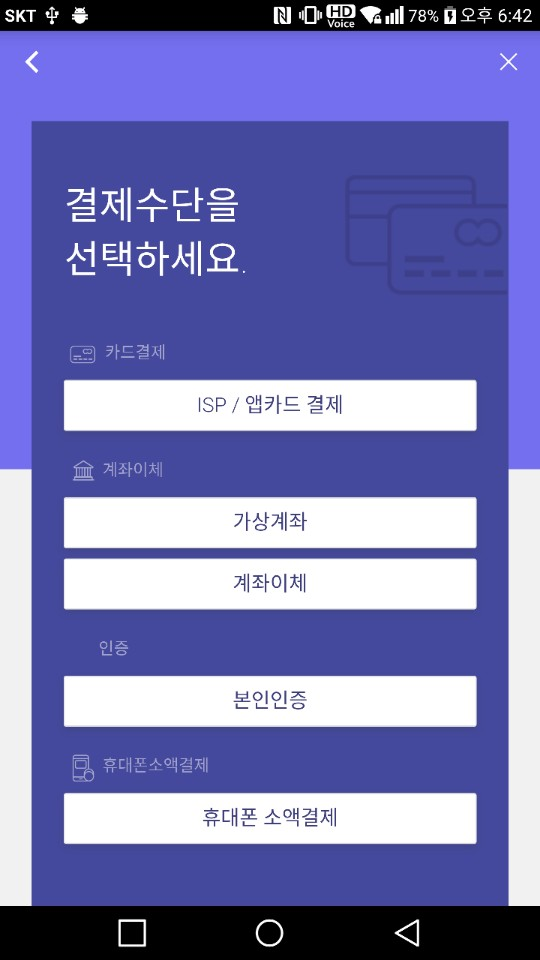

# client_android_java




build.gradle(Project):
```gradle
allprojects {
    repositories {
        jcenter()
        maven { url "https://jitpack.io" }
    }
}
```

build.gradle(Modlue):
```gradle
dependencies {
    compile 'com.github.bootpay:client_android_java:1.0.2'
}
```

manifests.xml
```xml
<uses-permission android:name="android.permission.INTERNET"/>
<uses-permission android:name="android.permission.ACCESS_NETWORK_STATE"/>
```

샘플 코드
```java
BootpayDialog.init(getFragmentManager())
        .setApplicationId("593f8febe13f332431a8ddae")
        .setPG(PG.DANAL)
        .setMethod(Method.CARD)
        .setName("맥북프로임다")
        .setOrderId(String.valueOf(System.currentTimeMillis()))
        .setPrice(1000)
        .addItem("마우스", 1, "123", 100)
        .addItem("키보드", 1, "122", 200)
        .setParams(new Test("test", 10, 10))
        .onCancel(new CancelListener() {
            @Override
            public void onCancel(@Nullable String s) {
                Log.d("cancel", s);
            }
        })
        .onConfirm(new ConfirmListener() {
            @Override
            public void onConfirmed(@Nullable String s) {
                Log.d("confirm", s);
            }
        })

        .onDone(new DoneListener() {
            @Override
            public void onDone(@Nullable String s) {
                Log.d("done", s);
            }
        })
        .onError(new ErrorListener() {
            @Override
            public void onError(@Nullable String s) {
                Log.d("error", s);
            }
        })
        .show();
```


Java8 - Lambda 지원
------------------

build.gradle(Module)
```gradle
android {
    ...
    defaultConfig {
        ...
        jackOptions {
            enabled true
        }
    }
    ...
    compileOptions {
        targetCompatibility 1.8
        sourceCompatibility 1.8
    }
}
```

샘플 코드
```java
BootpayDialog.init(getFragmentManager())
        .setApplicationId("593f8febe13f332431a8ddae")
        .setPG(PG.DANAL)
        .setMethod(Method.CARD)
        .setName("맥북프로임다")
        .setOrderId(String.valueOf(System.currentTimeMillis()))
        .setPrice(1000)
        .addItem("마우스", 1, "123", 100)
        .addItem("키보드", 1, "122", 200)
        .setParams(new Test("test", 10, 10))
        .onCancel(s -> Log.d("cancel", s))
        .onConfirm(s -> Log.d("confirm", s))
        .onDone(s -> Log.d("done", s))
        .onError(s -> Log.d("error", s))
        .show();
```
