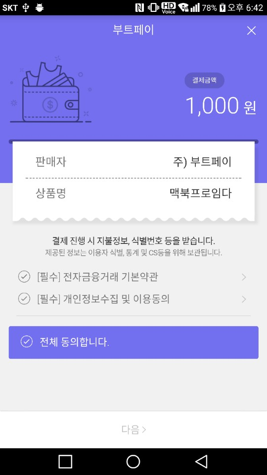

## PG Analytics
## 결제데이터 분석서비스
기존 PG 사를 이용 중이신 사업자도 별도의 계약없이
부트페이를 통해 결제 연동과 통계를 무료로 이용하실 수 있습니다.
한줄의 소스코드로 인사이트를 얻어 매출을 극대화하세요.



# Java 
## build.gradle (Project):
```gradle
allprojects {
    repositories {
        jcenter()
        maven { url "https://jitpack.io" }
    }
}
```

## build.gradle (Modlue):
```gradle
dependencies {
    compile 'com.github.bootpay:client_android_java:1.0.4'
}
```

## manifests.xml
```xml
<uses-permission android:name="android.permission.INTERNET"/>
<uses-permission android:name="android.permission.ACCESS_NETWORK_STATE"/>
```

## 샘플 코드
```java
BootpayDialog.init(getFragmentManager())
        .setApplicationId("59a7e647396fa64fcad4a8c2")
        .setPG(PG.DANAL)
        .setMethod(Method.CARD)
        .setName("맥북프로임다")
        .setOrderId(String.valueOf(System.currentTimeMillis()))
        .setPrice(1000)
        .addItem("마우스", 1, "123", 100)
        .addItem("키보드", 1, "122", 200)
        .onCancel(new CancelListener() {
            @Override
            public void onCancel(@Nullable String s) {
                Log.d("cancel", s);
            }
        })
        .onConfirm(new ConfirmListener() {
            @Override
            public void onConfirmed(@Nullable String s) {
                Log.d("confirm", s);
            }
        })

        .onDone(new DoneListener() {
            @Override
            public void onDone(@Nullable String s) {
                Log.d("done", s);
            }
        })
        .onError(new ErrorListener() {
            @Override
            public void onError(@Nullable String s) {
                Log.d("error", s);
            }
        })
        .show();
```


# Java8 - Lambda 지원

## build.gradle (Module)
```gradle
android {
    ...
    defaultConfig {
        ...
        jackOptions {
            enabled true
        }
    }
    ...
    compileOptions {
        targetCompatibility 1.8
        sourceCompatibility 1.8
    }
}
```

## 샘플 코드
```java
BootpayDialog.init(getFragmentManager())
        .setApplicationId("593f8febe13f332431a8ddae")
        .setPG(PG.DANAL)
        .setMethod(Method.CARD)
        .setName("맥북프로임다")
        .setOrderId(String.valueOf(System.currentTimeMillis()))
        .setPrice(1000)
        .addItem("마우스", 1, "123", 100)
        .addItem("키보드", 1, "122", 200)
        .onCancel(s -> Log.d("cancel", s))
        .onConfirm(s -> Log.d("confirm", s))
        .onDone(s -> Log.d("done", s))
        .onError(s -> Log.d("error", s))
        .show();
```

# [Kotlin](http://kotlinlang.org/) 설정
## build.gradle (Project)
```gradle
buildscript {
    dependencies {
        classpath "org.jetbrains.kotlin:kotlin-gradle-plugin:1.1.4"
    }
}
```

## build.gradle (Module)
```gradle
apply plugin: 'kotlin-android'

dependencies {
    compile 'org.jetbrains.kotlin:kotlin-stdlib-jre7:1.1.4'
}
```

## 샘플 코드
```kotlin
BootpayDialog.init(fragmentManager)
        .setApplicationId("593f8febe13f332431a8ddae")
        .setPG(PG.DANAL)
        .setMethod(Method.SELECT)
        .setName("맥북프로임다")
        .setOrderId(System.currentTimeMillis().toString())
        .setPrice(1000)
        .addItem("마우스", 1, "123", 100)
        .addItem("키보드", 1, "122", 200)
        .onCancel { Log.d("cancel", it) }
        .onConfirm { Log.d("confirm", it) }
        .onDone { Log.d("done", it) }
        .onError { Log.d("error", it) }
        .show()
```

<hr/>

### 더 자세한 정보는 [Wiki](https://github.com/bootpay/client_android_java/wiki)를 참조해주세요. 
